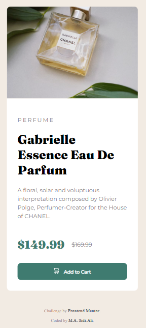

# Frontend Mentor - Product preview card component

This is a solution to the [Product preview card component coding challenge on Frontend Mentor](https://www.frontendmentor.io/challenges/product-preview-card-component-GO7UmttRfa). Frontend Mentor challenges help you improve your coding skills by building realistic projects.

## Table of contents

- [Overview](#overview)
  - [The challenge](#the-challenge)
  - [Screenshot](#screenshot)
  - [Links](#links)
- [My process](#my-process)
  - [Built with](#built-with)
  - [What I learned](#what-i-learned)
  - [Continued development](#continued-development)
  - [Useful resources](#useful-resources)
- [Author](#author)

## Overview

### The challenge

The challenge is to build out this product preview card component and get it looking as close to the design as possible.

Users should be able to:

- View the optimal layout depending on their device's screen size
- See hover and focus states for interactive elements

### Screenshot

Below is a screenshot of the desktop version of my solution.

Below is a screenshot of the mobile version of my solution.

### Links

- [Solution](https://github.com/Sidi-Ali/product-review-card-component)
- [Live Site](https://sidi-ali.github.io/product-review-card-component/)

## My process

I used a desktop-first workflow to complete this project.

### Built with

- HTML
- CSS
- Flexbox

### What I learned

I learnt about HTML picture element.

### Continued development

I am going to continue learning frontend Web development.

### Useful resources

- [HTML picture element](https://www.w3schools.com/html/html_images_picture.asp) -  This helped me to understand how different pictures are displayed on different screen sizes.

## Author

- linkedin - [M. A. Sidi-Ali](https://www.linkedin.com/in/muhammad-adamu-sidi-ali-907a486b/)
